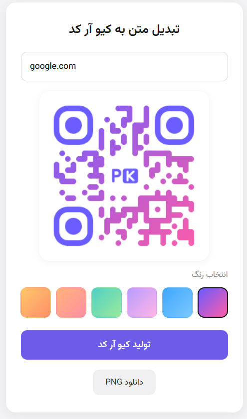
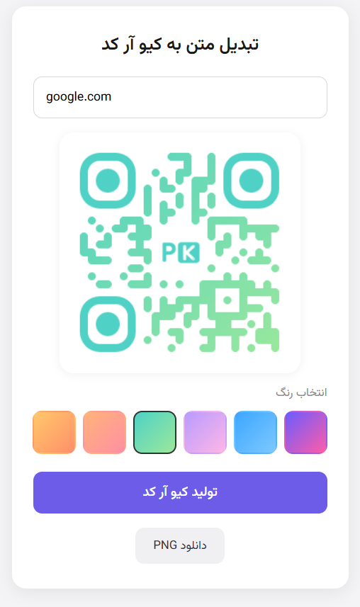
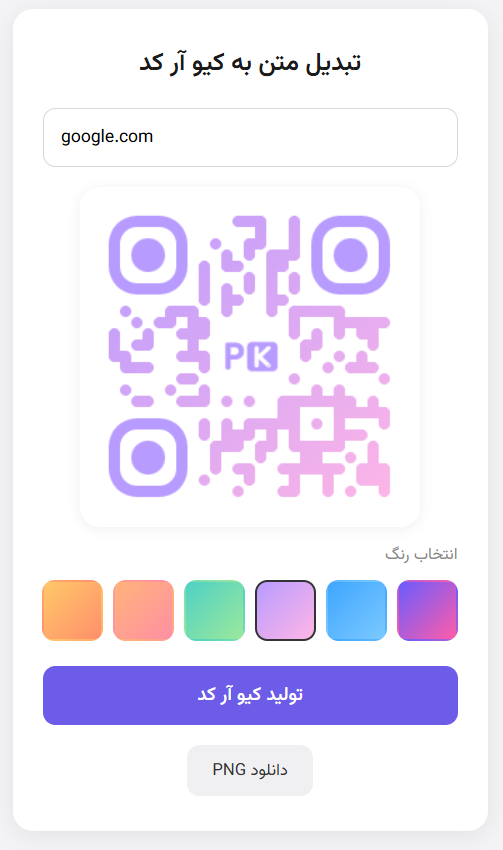
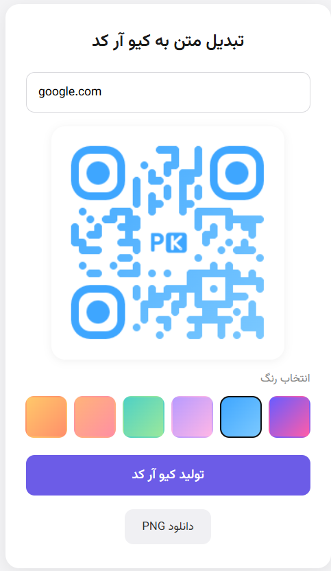
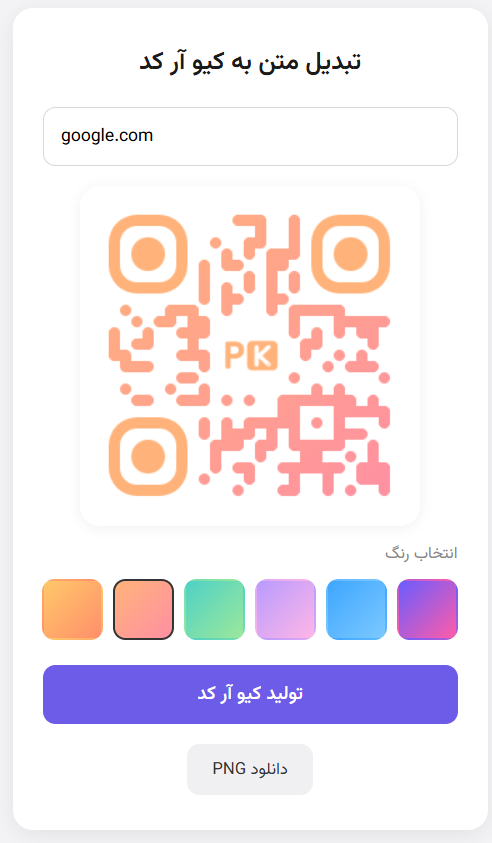
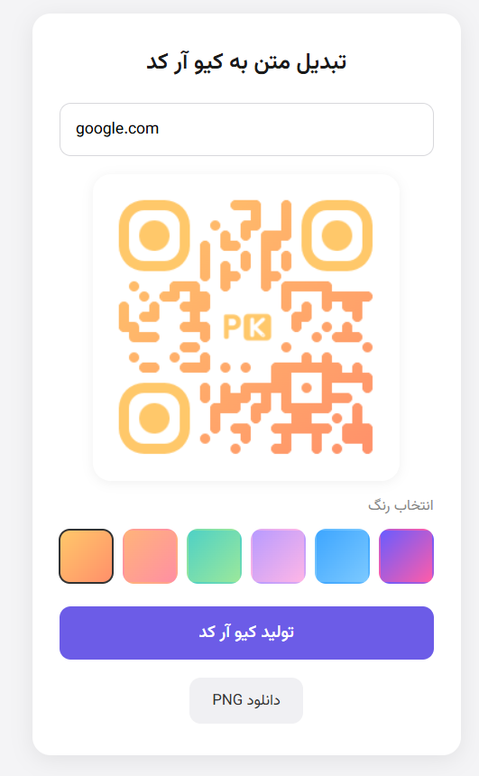

<div align="center">

# 🔳 تولیدکننده کیو آر کد پروفایل

**ساخت کیو آر کد با رنگ دلخواه و لوگوی مرکزی — مستقیم از دیتابیس شما.**


[🇬🇧 English version](README.md)

</div>

---

## ✨ امکانات

- 🎨 **۶ رنگ آماده** — با یک کلیک روی هر رنگ، کیو آر کد بلافاصله تغییر رنگ می‌دهد
- 🖼️ **لوگو یا عکس پروفایل در مرکز** — مستقیم از دیتابیس برای هر کاربر
- ⚡ **رندر سمت سرور** — دیتای کیو آر کد و عکس از طریق PHP می‌آید، نیازی به ورودی دستی نیست
- 📥 **دانلود با یک کلیک** به‌صورت PNG
- 🕸️ ساخته‌شده روی کتابخانه [`qr-code-styling`](https://github.com/kozakdenys/qr-code-styling) — کیو آر کدهای گرد و نقطه‌ای، نه فرم چهارگوش معمولی
- 🌐 پشتیبانی کامل از راست‌به‌چپ، رابط کاربری فارسی به‌صورت پیش‌فرض

---

## 📸 پیش‌نمایش

<p align="center">
  
  
  
     
     
     
</p>


---

## 🚀 راه‌اندازی

۱. نیاز به PHP نسخه ۷.۴ به بالا با یک وب‌سرور فعال دارد (برای تست محلی `php -S localhost:8000` کافیه).

۲. تابع `getUserData()` در `index.php` رو به کوئری واقعی دیتابیس خودتون وصل کنید:

```php
function getUserData($userId) {
    // این رو با یک کوئری واقعی PDO یا mysqli جایگزین کنید
    return [
        'username'    => 'exampleuser',
        'profile_url' => 'https://yoursite.com/u/exampleuser',
        'avatar_path' => 'uploads/default-avatar.png'
    ];
}
```

۳. صفحه رو با آدرس `index.php?id=123` برای هر شناسه کاربری باز کنید.

---

## 🎨 سفارشی‌سازی رنگ‌ها

دکمه‌های رنگ رو در `index.php` ویرایش کنید:

```html
<button class="swatch" style="background:#2563eb" data-color="#2563eb"></button>
```

می‌تونید رنگ اضافه، حذف یا تغییر بدید — `JScript.js` به‌صورت خودکار مقدار `data-color` رو می‌خونه.

---

## 🧩 نکات فنی

- سطح تصحیح خطا روی `H` قفل شده — این سطح برای اینکه عکس وسط باعث خراب شدن قابلیت اسکن نشه لازمه.
- نام کاربری در سمت سرور با `htmlspecialchars()` ایمن‌سازی می‌شه تا از حملات XSS ذخیره‌شده جلوگیری بشه.
- کتابخانه `qr-code-styling` از `unpkg` بارگذاری می‌شه — اگه به پشتیبانی آفلاین نیاز دارید، خودتون میزبانیش کنید.

---

## 📄 مجوز

شما مجازید آزادانه از این فایل در پروژه های خودتون استفاده کنید


---
